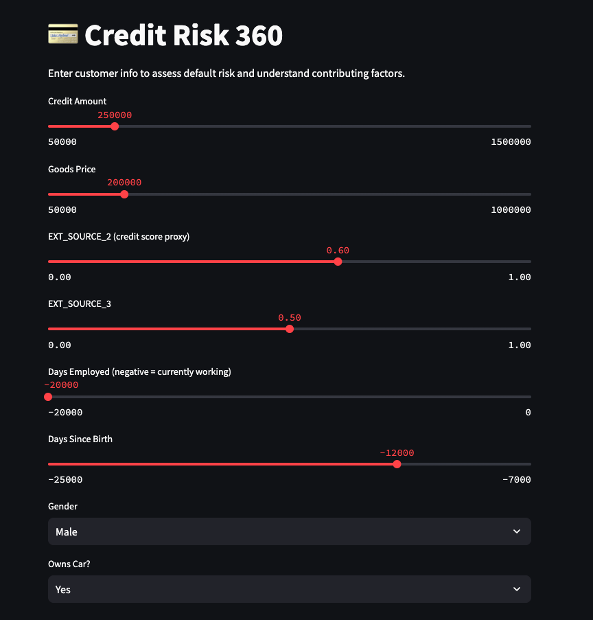
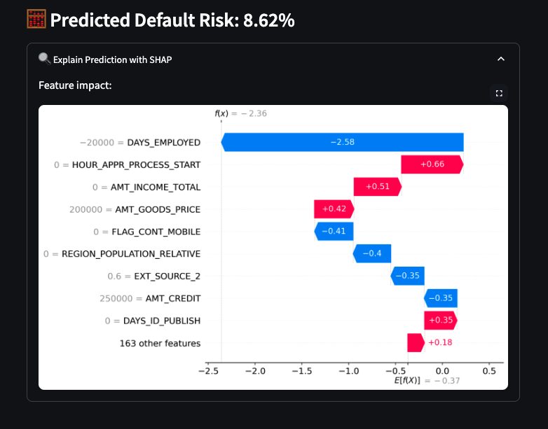

# CreditRisk360 🚦
An end-to-end explainable credit risk modeling pipeline using machine learning and SHAP visualizations.

## 🔍 Objective
Predict loan default risk and provide transparent, user-friendly explanations to support fair and informed lending decisions.

## 🧰 Tech Stack
- Python, pandas, scikit-learn, XGBoost
- SHAP for explainability
- Streamlit for interactive web app
- Data: [Home Credit Default Risk dataset](https://www.kaggle.com/competitions/home-credit-default-risk/data)

## 📁 Project Structure
- `notebooks/`: EDA + modeling experiments
- `app/`: Streamlit app code
- `models/`: Saved ML models
- `reports/`: Visuals (e.g., SHAP plots)
- `data/`: Raw and cleaned datasets

## 🚀 Run the App
```bash
streamlit run app/main.py
```




